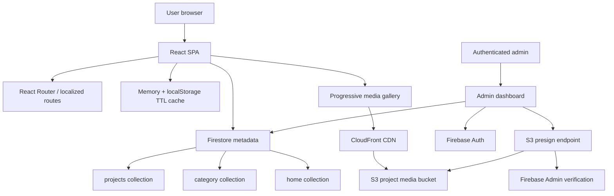
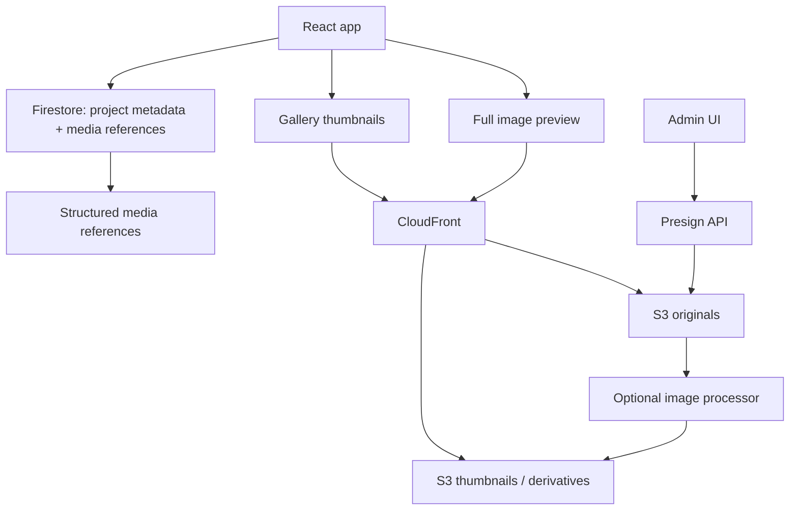
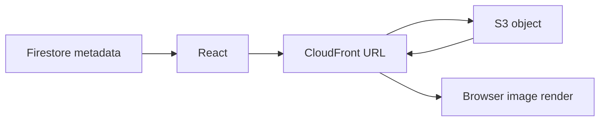
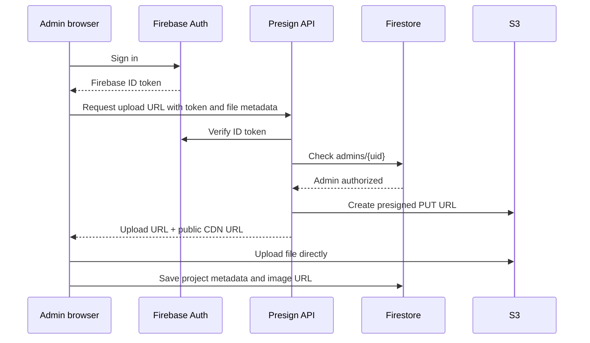
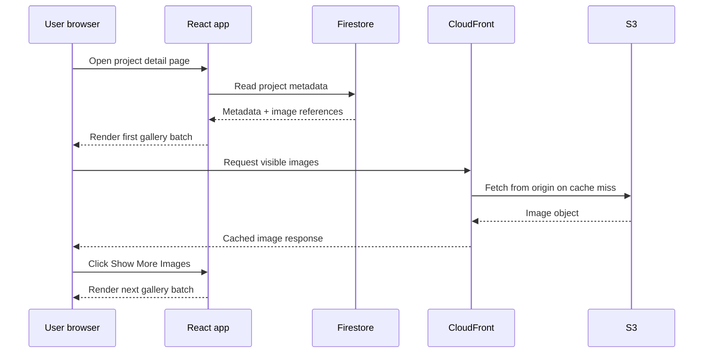

# High Level System Design: Engineering Project Showcase

## Glossary

| Term | Meaning |
| --- | --- |
| Engineering Project Showcase | The ZePedro construction engineering portfolio application. It presents civil engineering projects, media galleries, maps, project outcomes, and professional profile content. |
| CDN | Content Delivery Network. A distributed delivery layer that caches and serves static content closer to users. |
| CloudFront | AWS CDN service used or prepared for global delivery of project media assets. |
| S3 | Amazon Simple Storage Service. Durable object storage for high-resolution images and future technical assets. |
| Firestore | Firebase document database used for project metadata, category metadata, home/profile content, and admin allow-list checks. |
| Project metadata | Structured project data such as title, category, location, organization, dates, responsibilities, outcomes, image references, coordinates, and model metadata. |
| Image reference | A stored path or URL that points to an image asset. The binary image is not stored in Firestore. |
| Progressive gallery rendering | Frontend strategy that renders an initial batch of media and exposes additional assets through user action. |
| Lazy loading | Browser-level image loading strategy that delays image downloads until the image is likely to be needed. |
| Presigned upload URL | Temporary upload URL generated by a trusted backend so the browser can upload directly to S3 without receiving AWS credentials. |
| PWA | Progressive Web App. The application includes a manifest, service worker, offline shell, and cache behavior. |
| BIM / GLB / GLTF | 3D model formats and model viewer capability used for optional project model visualization. |

## Executive Summary

The Engineering Project Showcase is a high-performance React application built to present a construction engineer's portfolio through structured project data, multilingual content, image-heavy project galleries, GIS-ready project locations, and optional BIM/3D model assets.

The central architectural challenge is media-heavy delivery. Construction portfolios require visual evidence: site progress images, bridges, roads, drainage works, residential buildings, airport pavement rehabilitation, and technical documentation. In the current exported dataset, the system represents 16 projects and about 141 project images, with several project galleries containing 12 to 15 images each. Without an explicit media architecture, pages can become slow, expensive, and hard to scale.

The current architecture separates concerns:

- React renders the frontend and user flows.
- Firestore stores structured project metadata and image references.
- S3 stores high-resolution image files.
- CloudFront serves public media assets globally.
- A serverless presign endpoint verifies Firebase admins and returns temporary S3 upload URLs.
- The frontend renders galleries progressively and uses native lazy image loading.
- A client-side cache layer reduces redundant Firestore reads.
- A service worker provides an offline shell and caches same-origin shell/media assets.

The recommended path is to keep the current React + Firestore + S3 + CloudFront design, then harden it into a production media platform by standardizing asset schemas, enforcing cache policies, adding image derivative generation, strengthening admin upload policy, and introducing performance observability.

This design document captures the current system, the target direction, the rollout plan, and the key technical decisions required to turn the project from a successful portfolio into a reusable, scalable architecture for media-heavy engineering showcases.

## Problem

The application must present a professional engineering portfolio while preserving fast page loads and a smooth browsing experience. The site is not a simple text portfolio. It includes construction project galleries, localized routes, project metadata, optional maps, and future-ready model assets. The media requirements create several problems:

1. High-resolution images are large and expensive to load directly from the origin.
2. Multiple images on a project page can compete for bandwidth and delay interactivity.
3. Storing image binaries in the database would make Firestore the wrong layer for media delivery.
4. Serving global users from one origin increases latency.
5. Admin upload must not expose AWS credentials to the browser.
6. The system must keep metadata editable without forcing a redeploy.
7. Project pages must remain usable on slower networks and mobile devices.
8. Future assets such as videos, BIM previews, and GLB/GLTF models must fit the architecture without rewriting the core data model.

Before the CDN and frontend media improvements, image-heavy pages could take around one minute to fully load. After moving assets to S3/CloudFront and improving gallery loading behavior, comparable pages loaded in seconds. This is the main case study result and the primary reason media architecture deserves first-class treatment in the system design.

## Requirements / Solution / What Is Needed

### Functional Requirements

- Render a public portfolio with project listing, project details, education, profile/about content, and multilingual routes.
- Read public project metadata from Firestore.
- Support English and Portuguese content through route-aware localization.
- Filter and paginate projects without loading the full project collection into the browser.
- Render project detail pages with structured text, extracted project metrics, and media galleries.
- Store project image references as URLs or paths, not as binary content in Firestore.
- Resolve image references through a configurable CDN base URL.
- Display project galleries progressively with a first batch and "show more" behavior.
- Use native browser lazy loading and async decoding for gallery images.
- Support public CDN delivery for high-resolution media.
- Provide a protected admin foundation for creating, editing, and deleting project metadata.
- Allow authenticated admins to request temporary upload URLs for S3 image uploads.
- Append uploaded public URLs to Firestore project metadata.
- Support optional GIS coordinates for a project map.
- Support optional BIM/3D model metadata and in-browser model viewing.
- Provide offline shell behavior for production builds.

### Non-Functional Requirements: High Level

- Performance: image-heavy project pages should load in seconds, not minutes.
- Scalability: media delivery should scale independently from Firestore reads.
- Security: AWS credentials must never be exposed in the frontend.
- Maintainability: project metadata should be editable without rebuilding the React app.
- Availability: public reads should remain resilient through local caching and service worker behavior.
- Global reach: users far from the origin should receive media from nearby CDN edge locations when assets are cached.
- Cost control: repeated image requests should hit CDN cache rather than repeatedly fetching from origin storage.
- Extensibility: the system should support future videos, model previews, and technical documents.

### Non-Functional Requirements: Low Level

- Firestore project queries must use pagination and count aggregation when listing projects.
- Firestore `in` filters must respect the 10-value limit.
- Client-side cache entries should expire through TTL invalidation.
- Image object keys should be stable, project-scoped, sanitized, and unique.
- Uploaded images should have explicit `Content-Type`.
- Public media assets should use long-lived cache headers when filenames are immutable.
- Presigned upload URLs should have short TTLs.
- Upload validation should enforce file type and maximum size.
- The admin endpoint should verify Firebase ID tokens and admin authorization.
- CDN base URLs must be environment-configurable.
- The frontend should tolerate absolute URLs and relative CDN paths.
- Offline caching should not break navigation or keep obsolete shell caches forever.

## Scope

### In Scope

- Public React portfolio application.
- Firestore-backed metadata model.
- Project listing and detail read patterns.
- CDN-backed image delivery.
- S3 storage architecture for high-resolution project images.
- CloudFront delivery layer.
- Presigned S3 upload workflow.
- Admin metadata editing foundation.
- Progressive gallery rendering.
- Lazy image loading.
- PWA shell and caching behavior.
- GIS and 3D/BIM support as architectural extension points.
- Recommended next steps for hardening and rollout.

### Out of Scope

- Full enterprise CMS workflow with audit history, editorial approval, and rollback.
- Full DAM system with automated tagging, moderation, and lifecycle governance.
- Server-side rendering migration.
- Paid map tile provider selection and production tile usage policy.
- Automated image transformation pipeline implementation.
- Video transcoding pipeline.
- Full RAG/LLM assistant over project documents.
- Computer vision pipeline for construction progress recognition.
- Detailed Terraform/CDK infrastructure-as-code implementation.

## Rollout Plan

### Phase 0: Baseline and Documentation

- Document the current architecture and media flow.
- Capture before/after performance evidence from Chrome DevTools, Lighthouse, or WebPageTest.
- Inventory current project count, image count, and largest galleries.
- Confirm production environment variables for CDN and upload endpoints.
- Use `docs/performance-baseline.md` as the measurement source of truth.
- Use `docs/media-architecture.md` as the asset storage, URL, caching, and rendering standard.
- Use `docs/operations-runbook.md` for deployment checks and incident response.

### Phase 1: Stabilize Current Production Media Flow

- Ensure `REACT_APP_CDN_BASE_URL` is configured for production builds.
- Confirm S3 bucket policy and CloudFront origin behavior.
- Confirm CORS settings for browser media access.
- Confirm immutable cache headers for uploaded image objects.
- Confirm admin upload endpoint is disabled or protected when not fully configured.
- Verify gallery lazy loading and progressive rendering on mobile and desktop.

### Phase 2: Harden Admin Upload

- Enforce Firebase admin authorization using an `admins/{uid}` allow-list or custom claims.
- Validate file size and image MIME type in the presign function.
- Standardize object keys under `projects/{projectId}/images/{uuid}-{name}`.
- Save returned public URLs or CDN paths into Firestore metadata.
- Add upload status and error reporting in the admin UI.
- Add manual operational runbook for failed uploads and content correction.

### Phase 3: Add Asset Derivatives

- Generate thumbnails and/or responsive image variants.
- Store `media.images` and `media.thumbnails` as paired arrays or structured objects.
- Render thumbnails in the grid and full-resolution images only in modal/detail contexts.
- Consider WebP/AVIF derivatives while preserving original uploads.
- Add cache invalidation strategy for replaced assets.

### Phase 4: Observability and Continuous Performance

- Track page load metrics and Core Web Vitals.
- Add performance budgets for image-heavy routes.
- Monitor CloudFront cache hit ratio, origin fetches, and error rates.
- Monitor Firestore reads and count aggregation patterns.
- Add regression checks before major media or data model changes.

### Phase 5: Future Expansion

- Attach verified GIS coordinates to remaining projects.
- Add optimized GLB/GLTF model assets.
- Add model previews and controlled model loading.
- Add document/video asset categories if client requirements expand.
- Evaluate server-side rendering only if SEO or initial content rendering requires it.

## Infrastructure

The system uses a lightweight cloud architecture composed of frontend hosting, Firebase services, AWS object storage, CDN delivery, and a serverless upload boundary.

### Main Infrastructure Components

- Frontend hosting: serves the React production build.
- Firebase Firestore: stores public metadata and admin allow-list documents.
- Firebase Auth: authenticates admins.
- AWS S3: stores high-resolution image files and future binary media.
- AWS CloudFront: delivers media assets globally and caches static content.
- Serverless presign endpoint: verifies Firebase admin identity and creates temporary S3 upload URLs.
- Browser cache/localStorage: stores query responses and reduces repeated Firestore reads.
- Service worker cache: provides offline shell and same-origin asset caching.

### Environment Configuration

Relevant environment variables include:

- `REACT_APP_CDN_BASE_URL`
- `REACT_APP_S3_UPLOAD_ENDPOINT`
- `REACT_APP_FIREBASE_API_KEY`
- `REACT_APP_FIREBASE_AUTH_DOMAIN`
- `REACT_APP_FIREBASE_PROJECT_ID`
- `REACT_APP_ADMIN_EMAILS`
- `AWS_REGION`
- `S3_BUCKET`
- `PUBLIC_ASSET_BASE_URL`
- `MAX_UPLOAD_BYTES`
- `URL_TTL_SECONDS`
- `ALLOWED_ORIGIN`

The frontend may expose Firebase web configuration and public CDN base URLs. The frontend must not expose AWS access keys or privileged backend credentials.

## Deployment Plan

### Frontend Deployment

1. Install dependencies with `npm install`.
2. Configure environment variables for Firebase and CDN delivery.
3. Build the React application with `npm run build`.
4. Deploy the production build to the selected static hosting platform.
5. Confirm route rewrites for React Router.
6. Confirm service worker behavior in production only.

### Backend / Serverless Deployment

1. Deploy the S3 presign function from `serverless/s3-presign`.
2. Configure function environment variables.
3. Grant the function permission to write to the target S3 bucket.
4. Ensure Firebase Admin SDK can verify ID tokens.
5. Configure CORS for the portfolio origin.
6. Connect API Gateway or equivalent HTTP endpoint.
7. Set `REACT_APP_S3_UPLOAD_ENDPOINT` to the deployed endpoint.

### Media Delivery Deployment

1. Create or select the S3 bucket for project assets.
2. Configure CloudFront distribution with S3 as origin.
3. Configure HTTPS and custom domain if required.
4. Configure cache behavior for immutable media.
5. Set `PUBLIC_ASSET_BASE_URL` to the CloudFront domain or media custom domain.
6. Set `REACT_APP_CDN_BASE_URL` if frontend stores relative media paths.
7. Validate that public media URLs load from CloudFront, not directly from S3.

## Current Architecture

The current application is a client-rendered React app backed by Firestore metadata and CDN-ready media references. Firestore remains focused on queryable data. Heavy assets are stored outside Firestore and delivered by an object storage/CDN path.

Important current implementation points:

- `src/Hooks/useProjectsServer.js` handles paginated Firestore listing, count aggregation, and cursor metadata caching.
- `src/utils/cacheStore.js` provides memory-first and localStorage-backed TTL caching.
- `src/components/project/ProjectDetails.jsx` resolves media references using `REACT_APP_CDN_BASE_URL`.
- `src/components/project/ProjectMediaGallery.jsx` renders gallery images in batches of six.
- Gallery images use `loading="lazy"` and `decoding="async"`.
- `src/pages/Admin/AdminDashboard.jsx` includes metadata editing and prepared S3 upload UI.
- `serverless/s3-presign/handler.mjs` verifies Firebase admins and returns temporary S3 upload URLs.
- `public/service-worker.js` caches shell assets and same-origin media/static requests.

## System Diagram



## Current Workflow

### Public Project Listing

1. User opens the project listing route.
2. React initializes localized routing and UI state.
3. `useProjectsServer` builds a Firestore query.
4. The hook uses Firestore count aggregation for total count.
5. The hook queries only the current page using cursor pagination.
6. Query results are cached with a TTL.
7. Project cards render metadata and link to details.
8. The browser does not load every project document at once.

### Public Project Detail

1. User opens a project detail page.
2. React reads the project document from Firestore.
3. The component extracts title, context, responsibilities, outcomes, metrics, and media references.
4. Media references are resolved into absolute URLs.
5. The gallery renders the first image batch.
6. Images load lazily and decode asynchronously.
7. Additional images render only after the user requests more.
8. Modal preview loads the selected full image.

### Admin Upload

1. Admin signs in through Firebase Auth.
2. Admin UI checks client-side allow-list configuration.
3. Admin selects one or more image files.
4. Browser sends file metadata to the presign endpoint with a Firebase ID token.
5. Presign endpoint verifies the token and checks `admins/{uid}`.
6. Endpoint validates file name, MIME type, and size.
7. Endpoint returns temporary S3 upload URLs and public CDN URLs.
8. Browser uploads files directly to S3.
9. Browser appends returned public URLs to the project image references.
10. Admin saves project metadata to Firestore.

## Design Discussion

The most important architectural principle is separation of responsibilities. Firestore should not serve as a media storage system. React should not embed heavy images in the app bundle. The CDN should not own project metadata. Admin upload should not expose privileged cloud credentials.

The current design follows this separation. It uses Firestore for metadata and S3/CloudFront for media. It also combines infrastructure-level optimization with browser-level optimization. CloudFront reduces network distance and origin pressure. Progressive rendering reduces initial browser work. Lazy loading reduces unnecessary downloads. Caching reduces repeated Firestore reads.

The next design question is how far to evolve the media layer. The current system can store image references and serve full images. A more complete production design should introduce thumbnails, responsive sizes, explicit asset metadata, and operational observability. This can be done incrementally without replacing the current stack.

## Design Approach 1: CDN-Backed Metadata Architecture (Recommended)

Keep Firestore as the metadata source, S3 as the media origin, CloudFront as the global delivery layer, and React as the rendering layer. Harden the existing architecture with standardized media objects, image derivatives, upload validation, and observability.

### New System Diagram



### Benefits

- Preserves the working architecture.
- Keeps Firestore reads small and queryable.
- Scales media independently through CDN.
- Improves frontend performance without a platform rewrite.
- Supports future image derivatives and model assets.
- Keeps admin upload secure through presigned URLs.
- Fits a static React deployment model.

### Tradeoffs

- Requires careful CDN/cache configuration.
- Requires extra operational discipline around upload validation.
- Without automated derivatives, original images can still be too large.
- Frontend remains client-rendered, so SEO improvements depend on metadata and content strategy rather than SSR.

## Design Approach 2: Firebase-Only Storage Architecture

Use Firebase Storage for image files and Firestore for metadata. Serve assets through Firebase hosting/storage URLs rather than CloudFront/S3.

### Benefits

- Simpler vendor footprint.
- Tighter integration with Firebase Auth and security rules.
- Lower initial infrastructure complexity.
- Easier for small teams already using Firebase.

### Tradeoffs

- Less explicit CDN control compared with CloudFront.
- Harder to align with AWS media architecture if future assets live in S3.
- May be less flexible for custom cache policies, origin behavior, and private/public media transitions.
- Migration would create churn without clear benefit because S3/CloudFront already solves the main bottleneck.

## Design Approach 3: Headless CMS + Managed Media Platform

Move project metadata and media management into a managed headless CMS or digital asset management service. React consumes CMS APIs, and media delivery is handled by the provider.

### Benefits

- Strong editorial workflows.
- Built-in asset transformation in some platforms.
- Non-technical content editing can improve.
- Preview, scheduling, and publishing flows may be available.

### Tradeoffs

- Adds vendor dependency and recurring cost.
- Requires migration from current Firestore data model.
- May be overkill for a single-client engineering portfolio.
- Custom GIS/BIM/project metadata may be less natural than the current tailored schema.
- Existing Firebase admin foundation would be partially replaced.

## Pros and Cons

| Approach | Pros | Cons | Recommendation |
| --- | --- | --- | --- |
| CDN-backed metadata architecture | Proven in this project, strong performance, clear separation, scalable media delivery | Needs cache discipline and media derivative work | Recommended |
| Firebase-only storage | Simpler Firebase integration | Less CDN control, weaker fit for AWS media path | Not recommended now |
| Headless CMS / DAM | Strong editorial and asset workflows | More cost, migration, and complexity | Consider only if editorial needs grow |

## Design Discussion: Recommended Path

The recommended architecture is not a rewrite. It is an incremental hardening of the current system. The project already has the right boundaries: Firestore stores metadata, S3 stores media, CloudFront delivers images, and React controls rendering. The next improvements should formalize these boundaries and reduce operational ambiguity.

The highest-value improvements are:

- Define a structured media object schema.
- Generate thumbnails and responsive variants.
- Continue using CloudFront as the public delivery layer.
- Keep presigned upload as the only browser-to-S3 upload path.
- Add basic performance and cache observability.
- Keep Firestore queries paginated and cached.

## Technical Decision 1: Media Storage and Delivery

### Approach 1: S3 + CloudFront (Recommended)

Use S3 for durable object storage and CloudFront for public media delivery. Store only CDN URLs or relative media paths in Firestore.



### Approach 2: Direct S3 Public URLs

Store public S3 URLs directly in Firestore and let browsers request images from S3 without CloudFront.

### Pros and Cons

| Option | Pros | Cons |
| --- | --- | --- |
| S3 + CloudFront | Lower latency for global users, cache control, origin offload, custom domain support | Requires CloudFront configuration and invalidation strategy |
| Direct S3 URLs | Simpler setup | Higher latency, weaker cache control, origin receives more traffic, less professional delivery path |

### Decision

Use S3 + CloudFront. The project is media-heavy and has already demonstrated major performance improvement after this move.

## Technical Decision 2: Gallery Loading Strategy

### Approach 1: Progressive Rendering + Lazy Loading (Recommended)

Render an initial image batch, load images lazily, decode asynchronously, and render more images only when the user requests them.

Current implementation:

- `IMAGE_BATCH_SIZE = 6`
- `imageItems.slice(0, visibleImageCount)`
- `loading="lazy"`
- `decoding="async"`

### Approach 2: Render All Images Immediately

Render every project image on page load and rely only on browser/network behavior.

### Pros and Cons

| Option | Pros | Cons |
| --- | --- | --- |
| Progressive + lazy | Faster initial render, reduced bandwidth contention, better mobile experience | Requires a small amount of UI state and user interaction for more images |
| Render all | Simpler UI code | Slow for large galleries, many parallel requests, poor perceived performance |

### Decision

Use progressive rendering and lazy loading. CDN delivery improves network latency, but the browser still needs a controlled loading strategy to avoid overwhelming the page.

## Technical Decision 3: Admin Upload Security

### Approach 1: Firebase-Verified Presigned S3 Uploads (Recommended)

The browser asks a trusted backend for temporary upload URLs. The backend verifies Firebase identity and admin authorization before creating upload URLs.

### Approach 2: Upload Through the Application Server

Admin uploads files to a backend server, and the backend streams files to S3.

### Pros and Cons

| Option | Pros | Cons |
| --- | --- | --- |
| Presigned uploads | No AWS keys in browser, browser uploads directly to S3, lower backend bandwidth, scalable | Requires careful validation and short TTLs |
| Server-proxied uploads | Centralized control and scanning point | Backend handles large file bandwidth, higher cost, more operational load |

### Decision

Use Firebase-verified presigned S3 uploads. This matches the current implementation and keeps the backend thin while protecting AWS credentials.

## Technical Decision 4: Metadata Querying

### Approach 1: Firestore Pagination + Count Aggregation + TTL Cache (Recommended)

Use Firestore server-side constraints, cursor pagination, aggregate counts, and local TTL caching.

### Approach 2: Load Full Collection Client-Side

Fetch every project document and filter/paginate in the browser.

### Pros and Cons

| Option | Pros | Cons |
| --- | --- | --- |
| Server-side query + cache | Lower read volume, better scale, faster listing, predictable pagination | More implementation complexity around cursors |
| Full collection fetch | Simple for very small datasets | Does not scale, wastes reads, slower on large project sets |

### Decision

Use Firestore pagination, count aggregation, and TTL caching. The current implementation is already aligned with this decision.

## References

- `README.md`: project architecture, implementation status, routes, environment variables, and S3 upload contract.
- `TECHROADMAP.md`: roadmap phases and future capabilities.
- `docs/performance-baseline.md`: performance budgets, measurement templates, and regression checklist.
- `docs/media-architecture.md`: media asset architecture, schema migration, URL strategy, and caching rules.
- `docs/operations-runbook.md`: operational procedures for deployments, uploads, CDN issues, and Firestore usage.
- `src/Hooks/useProjectsServer.js`: Firestore query, pagination, count aggregation, and cursor cache behavior.
- `src/utils/cacheStore.js`: memory/localStorage TTL cache implementation.
- `src/components/project/ProjectDetails.jsx`: project detail rendering and CDN URL resolution.
- `src/components/project/ProjectMediaGallery.jsx`: progressive gallery rendering and lazy image loading.
- `src/components/project/projectDetailsUtils.js`: image item mapping and project metric extraction.
- `src/pages/Admin/AdminDashboard.jsx`: admin metadata editing and S3 upload UI.
- `src/pages/Admin/useAdminAuth.ts`: Firebase Auth admin state.
- `serverless/s3-presign/handler.mjs`: Firebase-verified S3 presigned upload endpoint.
- `public/service-worker.js`: PWA shell and same-origin media/static caching.
- `projects-normalized-export.json`: normalized exported project dataset used for project/media inventory.

## Appendix

### Other Approaches Considered

#### Server-Side Rendering

Server-side rendering could improve initial HTML content and SEO for public pages. It is not required to solve the media bottleneck. The main performance issue was image delivery and gallery loading, so CDN and frontend loading strategies produced the highest immediate impact. SSR can be revisited if search indexing, rich previews, or first contentful paint become primary constraints.

#### Static JSON Export

The project could export all project data to static JSON and avoid Firestore reads at runtime. This would simplify public reads and improve static hosting behavior. The tradeoff is weaker admin editing and less live content management. Firestore remains a better fit while the project needs editable metadata.

#### Full Managed CMS

A managed CMS would improve editorial workflows but add migration, cost, and vendor lock-in. It is better considered after the admin workflow grows beyond project metadata edits and media uploads.

#### Direct Image Bundling

Bundling project images into the React app or public folder is not appropriate for this use case. It increases deployment size, couples content changes to app releases, and prevents independent media scaling.

### Cost Calculations

The design intentionally separates costs by workload:

- Firestore cost is driven by document reads, count aggregations, and admin writes.
- S3 cost is driven by object storage, upload requests, and origin reads.
- CloudFront cost is driven by data transfer and request volume.
- Serverless presign cost is driven by admin upload sessions, which should be low.

Approximate cost model:

```text
Monthly media storage cost =
  total_asset_gb * s3_storage_price_per_gb

Monthly CDN delivery cost =
  cdn_data_transfer_gb * cloudfront_transfer_price_per_gb
  + cdn_request_count * cloudfront_request_price

Monthly Firestore read cost =
  public_project_reads + category_reads + count_aggregations + admin_reads

Monthly upload control cost =
  presign_invocations * serverless_request_price
  + presign_compute_duration
```

The architecture reduces repeated origin and database pressure by allowing CloudFront to cache media and the browser to cache Firestore query responses temporarily.

### Other Diagrams

#### Admin Upload Sequence



#### Public Gallery Sequence



### Open Questions

- Should media references be stored as full CloudFront URLs or relative paths resolved by `REACT_APP_CDN_BASE_URL`?
- Should the system generate thumbnails automatically during upload or through a manual preprocessing step?
- Should original images remain publicly accessible through CloudFront, or should only optimized derivatives be public?
- What performance budget should be enforced for project detail pages?
- What monitoring should be used for CloudFront cache hit ratio and image error rates?
- Should admin write access use Firestore `admins/{uid}` documents, Firebase custom claims, or both?
- Should future model assets use the same S3/CloudFront media path as images?

### Suggested Media Object Schema

```json
{
  "media": {
    "images": [
      {
        "id": "site-progress-001",
        "alt": {
          "en": "Bridge construction progress",
          "pt": "Progresso da construcao da ponte"
        },
        "originalUrl": "projects/project-id/images/original.jpg",
        "thumbUrl": "projects/project-id/images/thumb.webp",
        "width": 1600,
        "height": 1000,
        "contentType": "image/jpeg",
        "sizeBytes": 2400000
      }
    ]
  }
}
```

This schema is more explicit than parallel arrays and can support responsive images, alt text, asset IDs, ordering, and future moderation metadata.
