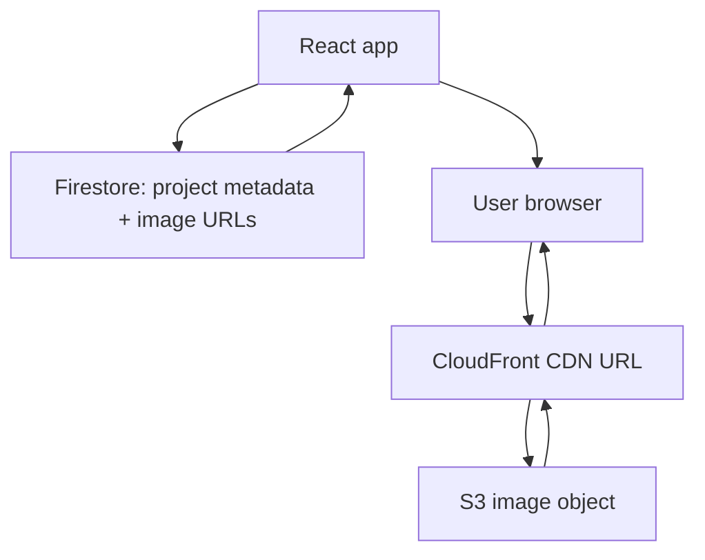

# Media Architecture

## Purpose

This document defines how project images and future media assets should be stored, referenced, delivered, and rendered in the Engineering Project Showcase.

The guiding principle is separation of responsibilities:

- Firestore stores metadata and asset references.
- S3 stores original binary assets.
- CloudFront delivers public media globally.
- React decides how and when media is rendered in the browser.
- A trusted serverless boundary creates temporary upload access for admins.

## Current Media Flow



The React app reads project metadata from Firestore. The metadata contains image references. The browser requests images through CloudFront URLs. S3 acts as the durable origin, not as the primary public delivery surface.

## Current Implementation

Relevant files:

- `src/components/project/ProjectDetails.tsx`
- `src/components/project/ProjectCard.tsx`
- `src/components/project/projectMedia.ts`
- `src/components/project/ProjectDetails.jsx`
- `src/components/project/ProjectMediaGallery.jsx`
- `src/components/project/projectDetailsUtils.js`
- `src/utils/assetUrl.js`
- `src/pages/Admin/AdminDashboard.jsx`
- `serverless/s3-presign/handler.mjs`

Current frontend behavior:

- Image references may be absolute URLs or relative paths.
- Relative paths are resolved with `REACT_APP_CDN_BASE_URL`.
- URL resolution strips duplicate slashes between the configured CDN base URL and the stored image path.
- Gallery rendering starts with `IMAGE_BATCH_SIZE = 6`.
- Additional images render through "Show More Images".
- Gallery images use `loading="lazy"`.
- Gallery images use `decoding="async"`.
- The active TypeScript project detail route normalizes both legacy string image references and structured media objects.
- The active JavaScript gallery path also supports legacy string image references and structured media objects.
- `media.images` is the canonical project gallery source; `imageRefs` is supported only as a legacy read fallback.
- Structured media objects can provide `thumbUrl`, `thumbnailUrl`, `largeUrl`, `originalUrl`, `alt`, `width`, and `height`.
- The gallery can render a lighter display reference while preserving the original/full reference for modal preview.

Current admin/upload behavior:

- Admin selects one or more images.
- Admin edits the same content groups rendered on project detail pages:
  - `context`: Project Overview.
  - `activities`: Technical Scope & Responsibilities.
  - `projectOutcome`: Role & Outcome.
  - `media.images`: Project Gallery.
- Browser asks `REACT_APP_S3_UPLOAD_ENDPOINT` for upload URLs.
- Request includes Firebase ID token.
- Serverless handler verifies admin authorization.
- Handler returns temporary S3 upload URLs and public URLs.
- Uploaded URLs are appended to project image references.
- Admin saves only write `media.images`; legacy `imageRefs` is removed on edit.
- The admin image textarea accepts one image path, URL, or structured media JSON object per line.

Current production observations from the initial baseline pass:

- Exported project media references are relative paths, not absolute URLs.
- The configured local CDN base URL points to CloudFront.
- Sample project images return through CloudFront with S3 as origin.
- Sample existing objects did not expose explicit `Cache-Control` headers.
- The presigned upload handler already sets immutable cache headers for new uploads, so older media objects should be reviewed separately before assuming uniform cache behavior.

## Asset Storage Rules

### S3 Object Key Convention

Use project-scoped, sanitized, unique object keys.

```text
projects/{projectId}/images/{timestamp}-{uuid}-{safeName}.{extension}
```

The current presign handler follows this pattern:

```text
projects/{safeProjectId}/images/{Date.now()}-{randomUUID()}-{baseName}{extension}
```

This convention should be preserved because it:

- avoids collisions
- groups assets by project
- creates immutable filenames
- makes CDN caching safer
- keeps manual operations understandable

### Original Assets

Original uploaded images should be stored in S3 and delivered through CloudFront when public.

Rules:

- Do not store image binaries in Firestore.
- Do not import project gallery images into the React source bundle.
- Do not rely on direct S3 URLs for public project rendering unless documented as a temporary exception.
- Prefer immutable object names over overwriting existing keys.

### Future Derivative Assets

When thumbnails or responsive variants are added, use a predictable derivative structure.

```text
projects/{projectId}/images/original/{assetId}.{extension}
projects/{projectId}/images/thumb/{assetId}.webp
projects/{projectId}/images/large/{assetId}.webp
```

This can be introduced later without breaking the current URL model.

## Firestore Media Model

### Current Compatible Model

The application currently stores project gallery references under `media.images`:

```json
{
  "media": {
    "images": [
      "https://cdn.example.com/projects/project-id/images/photo.jpg"
    ]
  }
}
```

This is simple, but it does not carry image dimensions, alt text, derivatives, or ordering metadata beyond array position. Legacy `imageRefs` can still be read by the frontend during migration, but it should not be written by the admin UI.

### Supported Media Object Model

The frontend now supports structured media objects while preserving support for legacy string arrays. Firestore records do not need to be migrated immediately; this support lets new records adopt richer media metadata gradually.

```json
{
  "media": {
    "images": [
      {
        "id": "site-progress-001",
        "order": 1,
        "alt": {
          "en": "Bridge construction progress",
          "pt": "Progresso da construcao da ponte"
        },
        "originalUrl": "projects/project-id/images/original/site-progress-001.jpg",
        "thumbUrl": "projects/project-id/images/thumb/site-progress-001.webp",
        "largeUrl": "projects/project-id/images/large/site-progress-001.webp",
        "width": 1600,
        "height": 1000,
        "contentType": "image/jpeg",
        "sizeBytes": 2400000,
        "createdAt": "2026-06-26T00:00:00.000Z"
      }
    ]
  }
}
```

Benefits:

- better accessibility through alt text
- better SEO through descriptive image metadata
- safer responsive rendering through dimensions
- smaller initial loads through thumbnails
- easier media management in the admin UI
- easier migration to future video/model/document assets

## URL Strategy

### Recommended

Store relative CDN paths in Firestore and resolve them at runtime with `REACT_APP_CDN_BASE_URL`.

Example Firestore value:

```text
projects/project-id/images/photo.jpg
```

Resolved runtime URL:

```text
https://cdn.example.com/projects/project-id/images/photo.jpg
```

Benefits:

- allows CDN domain changes without rewriting Firestore documents
- keeps metadata portable between staging and production
- avoids mixing environment-specific hostnames in content records
- avoids broken asset requests by joining base URL and stored path with normalized slashes

### Accepted Exception

Absolute URLs are acceptable when:

- assets are externally hosted
- migration is in progress
- the source system already returns a final public CDN URL

Frontend URL resolution must continue to tolerate both absolute URLs and relative paths.

## Caching Policy

### S3 / CloudFront

For immutable media objects, use:

```text
Cache-Control: public, max-age=31536000, immutable
```

The current presign handler sets this cache control value for uploaded images.

Rules:

- Prefer new object keys when replacing an image.
- Avoid overwriting existing media at the same key.
- Use CloudFront invalidation only when an object must be replaced at the same URL.
- Keep public media cacheable.

### Browser / React

Rules:

- Render only the first gallery batch initially.
- Use lazy loading for gallery images.
- Use async decoding for images.
- Use thumbnails when available.
- Load originals only when needed for detail/modal views.

## Upload Policy

### Current Serverless Validation

The presign handler validates:

- file name is present
- content type starts with `image/`
- size is positive
- size does not exceed `MAX_UPLOAD_BYTES`
- admin has a valid Firebase ID token
- admin exists in `admins/{uid}`

### Recommended Additions

- Require known image extensions: `.jpg`, `.jpeg`, `.png`, `.webp`, `.avif`.
- Normalize file names aggressively.
- Add optional per-project upload count limits.
- Record upload metadata in Firestore.
- Require alt text before project publication when structured media schema is adopted.
- Consider malware/content scanning if uploads are opened to more admins or contributors.

## Frontend Rendering Rules

### Listing Pages

- Do not load every full gallery image.
- Use only primary/cover image when needed.
- Keep project listing query paginated.
- Avoid gallery preloading in list cards.

### Detail Pages

- Render text and metadata first.
- Render an initial gallery batch only.
- Defer remaining gallery images until user action.
- Use thumbnail URLs when available.
- Use original URLs only for modal/full preview.
- Preserve layout dimensions to avoid layout shift.

### Modal Preview

- Open the full-resolution image only for the selected asset.
- Keep alt text meaningful.
- Consider adding next/previous navigation only if it does not trigger eager downloads.

## Migration Plan

### Phase 1: Keep Existing Strings

- Continue reading legacy `imageRefs` while making `media.images` canonical.
- Normalize URL resolution.
- Document CDN and upload rules.

### Phase 2: Add Optional Structured Objects

- Allow `media.images` to contain objects. Completed in the active TypeScript detail route and active JavaScript gallery path.
- Map string values into object-like runtime records. Completed in `src/components/project/projectMedia.ts`.
- Add `thumbUrl`, `alt`, `width`, and `height` support. Completed in runtime rendering; Firestore backfill remains optional.
- Keep admin UI backward compatible.
- Use `scripts/backfill-project-media-schema.mjs` to dry-run or backfill `imageRefs` from existing `media.images` values.
- Use `scripts/migrate-project-detail-schema.mjs` to migrate legacy `responsibilities` / `results` into `activities`.
- Use `scripts/remove-project-image-refs.mjs` to remove duplicated legacy `imageRefs` after `media.images` is confirmed.

Backfill dry-run:

```powershell
node scripts\backfill-project-media-schema.mjs
```

Backfill write mode requires an authenticated Firebase admin user:

```powershell
$env:FIREBASE_ADMIN_EMAIL="admin@example.com"
$env:FIREBASE_ADMIN_PASSWORD="..."
node scripts\backfill-project-media-schema.mjs --write
```

Project detail schema migration:

```powershell
node scripts\migrate-project-detail-schema.mjs
```

Apply writes only from an authenticated admin context:

```powershell
$env:FIREBASE_ADMIN_EMAIL="admin@example.com"
$env:FIREBASE_ADMIN_PASSWORD="..."
node scripts\migrate-project-detail-schema.mjs --write
```

Remove duplicated legacy image references:

```powershell
node scripts\remove-project-image-refs.mjs
```

Apply writes only after dry-run shows `unsafe: []`:

```powershell
$env:FIREBASE_ADMIN_EMAIL="admin@example.com"
$env:FIREBASE_ADMIN_PASSWORD="..."
node scripts\remove-project-image-refs.mjs --write
```

### Phase 3: Generate Derivatives

- Add thumbnail generation.
- Add large optimized derivative generation.
- Update gallery to prefer thumbnails.
- Keep originals for modal/full view.

### Phase 4: Enforce Structured Media

- Require structured objects for new uploads.
- Backfill old image references gradually.
- Add admin validation before publish.

## Acceptance Criteria

- [ ] Public project media loads from CloudFront or configured CDN.
- [ ] Firestore stores references, not image binaries.
- [ ] Project listing does not eagerly load full galleries.
- [x] Project details render a controlled initial image batch.
- [x] Gallery images use lazy loading and async decoding.
- [ ] Admin upload uses presigned URLs.
- [ ] AWS credentials are not exposed to the frontend.
- [ ] Upload validation enforces type and size limits.
- [ ] Cache headers are long-lived for immutable media.
- [x] The system reads legacy `imageRefs` but stores canonical gallery data in `media.images`.
